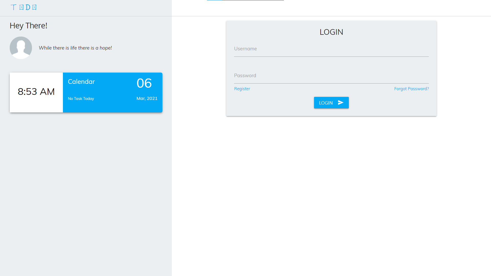
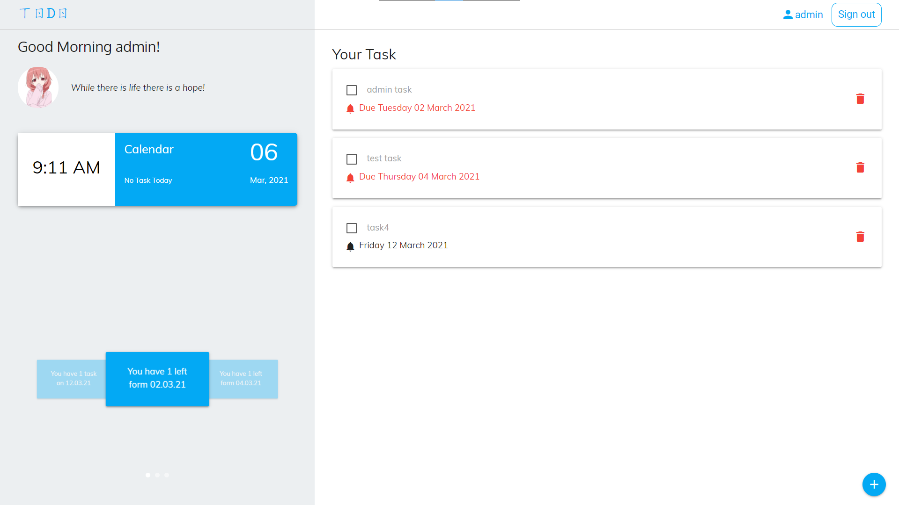

# 𝓣𝓻𝓪𝓬𝓴  𝔂𝓸𝓾𝓻  𝓰𝓸𝓪𝓵𝓼

This web app helps you to keep track of your daily goals.

Users can register themself and add their todos. User can update their information in the account section. User can also upload their avatar. And if any user ever forgot their password then they can reset their password by going to the reset password page, then it will check if any user exits with that username, and then a reset password link will be sent to their registered email Id. The email will be sent form [amankumar786dpsdh](mailto:amankumar786dpsdh@gmail.com?subject=HelpMe)

Technology used in this project:-

1. Pug and Sass has been used for front-end.

1. Node.js and Express for back-end.

1. For Database MongoDB has used.

1. For login any user Passportjs has been used.

1. Sentry has been used for error tracking.
